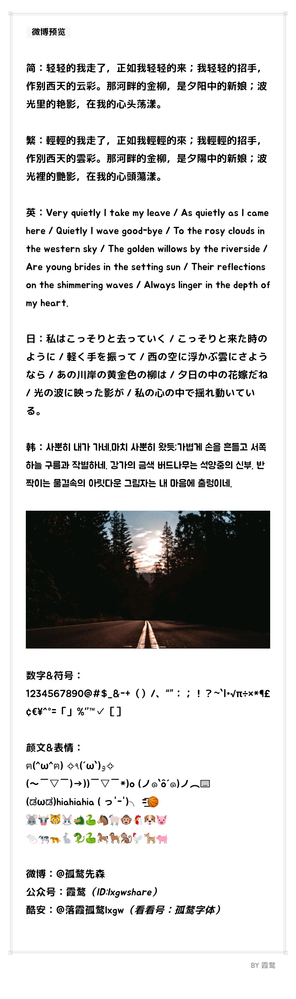

# 黑糖话梅 / Black Sugar Plum Candy
黑糖话梅：公众号「霞鹜」曾分享的手机美化字体，于 GitHub 正式开源发布。  
Black Sugar Plum Candy is a mobile phone beautification font formerly shared on the WeChat Official Account LXGWSHARE, and has now been officially open-sourced and released on GitHub.

## 字体简介
「黑糖话梅」是一款基于多款开源字体融合而成的可爱风格字体，最初通过[微博 @孤鹜先森](https://weibo.com/6624339726/Hp8cxpsQB)（2019.04）和[公众号「霞鹜」](https://mp.weixin.qq.com/s/-B8Ud_Me5eGbwYVMKx9CnQ)（2019.07）发布，应用于手机字体美化场景。目前该字体已正式在 GitHub 建立仓库，并依据 SIL Open Font License 1.1 协议开源发布。

### 制作该字体所利用的开源字体
#### 原始字体
- [思源黑体](https://github.com/Adobe-fonts/Source-han-sans) by Adobe，OFL 1.1；
- [M+ FONTS](https://github.com/coz-m/MPLUS_FONTS) by Coji Morishita（森下浩司），OFL 1.1；
- [Jua](https://github.com/woowabros/Jua) by Woowa Brothers，OFL 1.1；
#### 衍生字体
- [Rounded Mgen+](http://jikasei.me/font/rounded-mgenplus/) by jikasei.me，OFL 1.1；
- [源泉圆体](https://github.com/ButTaiwan/gensen-font) by But Ko，OFL 1.1。

### 注意事项
- 本字体为个人兴趣制作，非专业字体产品，使用前请充分了解其局限性。
- 本字体基于日文字体改造，汉字写法大多遵循日文标准，未调整为中国大陆规范字形。如对字形有特定要求，请留意此点。
- 本字体在制作过程中移除了 OpenType 特性，高级排版功能（如竖排特性等）无法使用，敬请注意。
- 谚文（韩文）部分：因 Jua 仅包含 2367 个常用谚文音节，剩余音节由思源黑体填充，故本字体所包含的谚文字形存在风格不统一的情况，使用本字体显示韩文时可能出现视觉不一致的问题。

## 授权信息
本字体是基于以下开源字体改造而成的衍生项目：
- [Rounded Mgen+](http://jikasei.me/font/rounded-mgenplus/)（[M+ FONTS](https://github.com/coz-m/MPLUS_FONTS) 的衍生字体）
- [思源黑体](https://github.com/Adobe-fonts/Source-han-sans) 及其衍生字体 [源泉圆体](https://github.com/ButTaiwan/gensen-font)
- [Jua](https://github.com/woowabros/Jua)

本项目遵循 [SIL Open Font License 1.1](https://openfontlicense.org/open-font-license-official-text/) 开源协议。
> [猫啃网](https://www.maoken.com/)提供 SIL Open Font License 1.1 非官方[简体中文译本](https://www.maoken.com/ofl)便于理解，仅供参考。

### 许可
- 这款字体无论是个人还是企业都可以自由使用，包括商用，无需付费，也无需另行知会原作者。（但如果告知，我会很感激。🫶）
- 这款字体可以自由传播、分享，可安装于系统、嵌入软件或 APP 中，也可与任何软件捆绑再分发或一并销售。（再分发时需附带 [OFL.txt](./OFL.txt) 全文。）
- 这款字体可以自由修改、改造，制作衍生字体。修改或改造后的字体也必须同样遵守 [SIL Open Font License 1.1](https://openfontlicense.org/open-font-license-official-text/) 所规定的条款与条件。

### 限制
- 根据 OFL 1.1「许可与条件」中第 1 条的规定，**禁止单独出售字体文件**（OTF/TTF 格式文件）。
- 根据 OFL 1.1「许可与条件」中第 5 条的规定，该字体不可在 OFL 1.1 以外的授权许可下发行，亦不可将该字体与可能造成许可证冲突的其他协议字体（如 GNU GPL、IPA 等）混合至同一字体文件。

### 条款覆盖说明
本字体最初通过微博和公众号以手机美化资源的形式分享。现已在 GitHub 正式开源发布，**授权方式以 SIL Open Font License 1.1 为准**。微博和公众号分享时期的“︁资源分发条款”︁**已作废**，一切使用、修改、再分发行为请遵照 OFL 协议执行。

## 字体下载
1. 点击【Clone or download】->【Download ZIP】下载 ZIP 格式压缩包，或者在 TTF 文件夹中下载字体文件。
2. [蓝奏云下载 ~~Magisk 模块~~，密码 bnaw](https://lxgw.lanzoum.com/b0cpy70rg)

## 更多开源字体
- [点击此处 / Click Here](https://github.com/lxgw/lxgw/blob/main/fonts.md)

